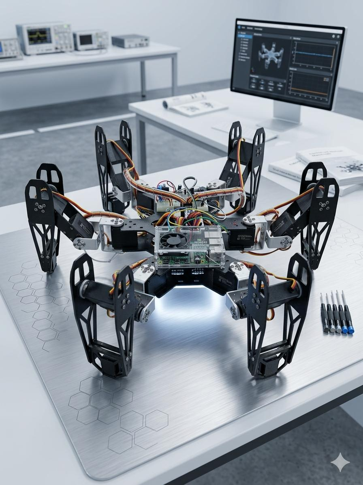
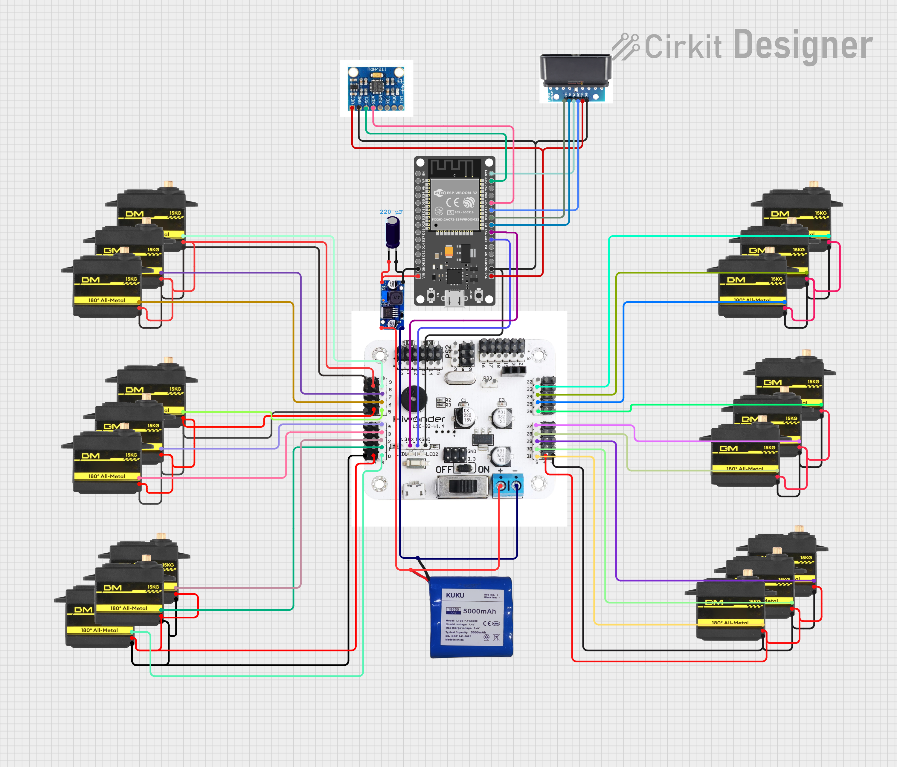

  
# 🕷️ SpiderBot
### 18-DOF Advanced Hexapod Robotics Platform

An advanced, open-source hexapod powered by an **ESP32** and a **Lobot LSC-32** controller. Featuring a custom Phase-Continuous Inverse Kinematics engine, full 6-DOF body control, and dynamic terrain adaptation.

<!-- SPACE FOR YOUR SPIDERBOT PICTURE -->

---

## ✨ Key Features (V3.6)

- **Phase-Continuous Gait Engine**: Gone are the rigid state machines! The bot uses continuous proportional phase accumulators with **4-point Cubic Bézier** swing trajectories for fluid, biological movement.
- **6-DOF Kinematics**: True independent body control. The chassis can Translate (X, Y, Z) and Rotate (Roll, Pitch, Yaw) dynamically, decoupled from foot placement.
- **Adaptive Terrain Engine**: Fuses data from active-low tactile foot switches and an MPU-6050 IMU. Uses Hexapod LERP logic to gracefully yield to rocks and auto-level the body on slopes in real-time.
- **PS2 DualShock Control**: Fully mapped wireless controller integration (via `PS2X_lib`) with analog omnidirectional mixing.
- **Over-The-Air (OTA)**: Flash new kinematics math wirelessly over your Wi-Fi network without tethering the bot.

---

## 📊 Technical Specifications

| Feature | Specification |
|---------|---------------|
| **Degree of Freedom (DOF)** | 18 (6 Legs × 3 Joints) |
| **Main Processor** | ESP32 Dual-Core (240MHz) |
| **Servo Controller** | Lobot LSC-32 (32-Channel, UART) |
| **Sensors** | MPU-6050 (6-Axis IMU), 6x Tactile Foot Contact Switches |
| **Primary Input** | PS2 Wireless DualShock (2.4GHz) |
| **Connectivity** | Bluetooth (Telemetry), Wi-Fi (ArduinoOTA), UART, I2C, SPI |
| **Power Input** | 7.4V 2S LiPo Battery (3250mAh 40C 148g recommended) |
| **Max Peak Current** | ~36A (during full gait surge) |
| **Body Frame** | 3D Printed / Laser-cut reinforced acrylic/carbon fiber |

---

## 🛒 Bill of Materials (BOM)

| Component | Quantity | Purpose |
|-----------|----------|---------|
| **38 Pin ESP32 Development Board** | 1 | Core Logic & Kinematics Engine |
| **Lobot LSC-32 Controller** | 1 | Hardware Servo Management |
| **RDS3115 MG Digital Servos** | 18 | Coxa, Femur, and Tibia joints |
| **MPU-6050 Module** | 1 | Real-time body levelling & Tilt sensing |
| **PS2 Wireless Receiver** | 1 | 2.4GHz Remote control interface |
| **Micro Limit Switches** | 6 | Tactile terrain mapping (Foot tips) |
| **2S LiPo Battery (7.4V)** | 1 | Main system power |
| **XL4015 5A DC-DC Buck** | 1 | Stabilizing ESP32 5V rail with 20uf electrolytic capacitor |

---

## 🛠️ Hardware & Wiring Diagram

<!-- SPACE FOR YOUR WIRING DIAGRAM -->

  

### Core Components
| Component | Function |
|-----------|----------|
| **ESP32** | Main brain. Computes all Inverse Kinematics and matrices in real-time. |
| **Lobot LSC-32** | 32-Channel servo controller. Receives batched UART frames from the ESP32. |
| **18x Servos** | 3 per leg (Coxa, Femur, Tibia). |
| **MPU-6050** | I2C 6-Axis Gyro/Accelerometer for real-time body leveling. |
| **PS2 Receiver** | SPI 2.4GHz receiver for the DualShock controller. |
| **Tactile Switches** | 6x active-low foot contact sensors for terrain mapping. |

### Pinout (ESP32)
- **UART2 (Lobot)**: `RX = 16`, `TX = 17` (Baud: 115200)
- **PS2 Controller (SPI)**: `DAT/MISO = 19`, `CMD/MOSI = 23`, `SEL/SS = 5`, `CLK/SCK = 18`
- **MPU-6050 (I2C)**: `SDA = 21`, `SCL = 22`
- **Foot Sensors**: `FL = 32`, `FR = 33`, `ML = 25`, `MR = 26`, `RL = 27`, `RR = 14`

---

## 🚀 Getting Started

### 1. Prerequisites
- Arduino IDE with ESP32 Board Manager installed.
- Required Libraries: `LobotServoController`, `PS2X_lib`.

### 2. Physical Calibration
The math assumes your servos are physically zeroed properly:
1. Set all 18 servos to `1500µs` (center).
2. Attach the servo horns so that the Coxa is 90° to the body, Femur is horizontal, and Tibia is pointing straight down.
3. Check `_Claude_Workplace/KNOWLEDGE_BASE.md` for exact physical dimensions.

### 3. Flash & Go
Open `spiderBotV3/spiderBotV3.6/spiderBotV3.6.ino` and upload to your ESP32. 

> **Warning:** Ensure your 2S LiPo battery is fully charged (>7.4V) before testing. 18 servos pulling stall current simultaneously will brownout the ESP32 if power is inadequate!

---

## 📜 Version History & Changelog

| Version | Major Features Added |
|---------|----------------------|
| **V1.0** | Initial 18-DOF hardware assembly. Basic Inverse Kinematics and Bluetooth command interface. |
| **V2.1** | Initial 18-DOF movement implementation with discrete leg control. |
| **V2.2** | Refined servo timing and initial Bluetooth command parser. |
| **V2.3** | Stabilized Inverse Kinematics and added basic gait coordination. |
| **V2.4** | Added 9 core movement functions, asymmetric arc walking, and live height control. |
| **V2.5** | Major optimization: Unified leg arrays and implemented a single-step execution model. |
| **V2.6** | Removed all delays. Added a non-blocking gait engine, command queue, and plug-and-play gaits (Tripod, Crab, Diagonal, Wave). |
| **V2.7** | Consolidated crab walk functions and integrated true omnidirectional joystick control. |
| **V2.8** | Reduced gait table complexity and improved pathfinding responsiveness. |
| **V3.1** | Physical PS2 DualShock integration and major Inverse Kinematics bugfixes (perpendicular tibia lock). |
| **V3.2** | Implemented ArduinoOTA for wireless deployment and non-blocking WiFi logic. |
| **V3.3** | Hardware upgrade: Integrated MPU-6050 auto-levelling and active-low tactile foot sensors. |
| **V3.4** | Mathematical leap: Replaced linear levelling with true 3D Roll/Pitch Rotational Matrices. |
| **V3.5** | Architectural leap: Discarded discrete state machines for a Phase-Continuous streaming engine using 4-point Bézier Z-curves. |
| **V3.6** | Added full 6-DOF body constraints (Translation + Yaw) and real-time Adaptive LERP Terrain handling mid-stride. |
| **V4.0** | Hardware refinement and modularization. Structural upgrades to support camera payloads. |
| **V5.0** | (Future) The Vision Leap: ESP32-CAM integration for autonomous object tracking and FPV web dashboard. |

---

## 📐 Kinematic Math & Theory

SpiderBot uses a hybrid geometric Inverse Kinematics (IK) solver and a parametric gait engine.

### 1. Inverse Kinematics (3-DOF)
Each leg calculates the required angles ($\alpha, \beta, \gamma$) based on the target coordinate $(x, y, z)$.
- **Coxa Angle**: $\theta_{coxa} = \text{atan2}(y, x)$
- **Femur/Tibia Calculation**: Uses the **Law of Cosines** on the triangle formed by the Femur and Tibia segments to find the relative joint angles based on the 2D distance $D = \sqrt{x^2 + y^2} - L_{coxa}$.

### 2. Phase-Continuous Bézier Trajectories
Unlike rigid state-machines, the swing phase uses a **4-point Cubic Bézier curve** to define the foot's path in 3D space:
$$P(t) = (1-t)^3P_0 + 3(1-t)^2tP_1 + 3(1-t)t^2P_2 + t^3P_3$$
This ensures zero-velocity tangential landings, which reduces mechanical shock and increases servo longevity.

---

## 🧠 System Architecture Overview

The system operates on a highly optimized, non-blocking time-sliced architecture (`SLICE_MS = 40ms`):
1. **Input Layer**: Polls PS2 controller (rate-limited to 20Hz) and IMU.
2. **Matrix Layer**: Calculates global Translation & Rotation transforms.
3. **Trajectory Layer**: Advances `legPhase` and evaluates Cubic Bézier points.
4. **IK Solver Layer**: Calculates the necessary Coxa, Femur, and Tibia angles.
5. **Output Layer**: Batches the `uint16_t` pulse-widths and blasts them over UART2 to the Lobot board.

### Deep Dive Documentation
Want to know how the math works? Check out the `_Claude_Workplace` directory for deep-dive documentation on the development process, exact kinematic formulas, and upcoming milestones (like the V5 Camera integration!).

---

## 🤝 Contributing
Contributions are welcome! If you have ideas for new gaits, sensor integrations, or math optimizations:
1. Fork the project.
2. Create your Feature Branch (`git checkout -b feature/AmazingFeature`).
3. Commit your changes (`git commit -m 'Add some AmazingFeature'`).
4. Push to the branch (`git push origin feature/AmazingFeature`).
5. Open a Pull Request.

## 📄 License
Distributed under the APACHE 2.0 License. See `LICENSE` for more information.

---

  <i>Built with math, servos, and a lot of caffeine.</i>

